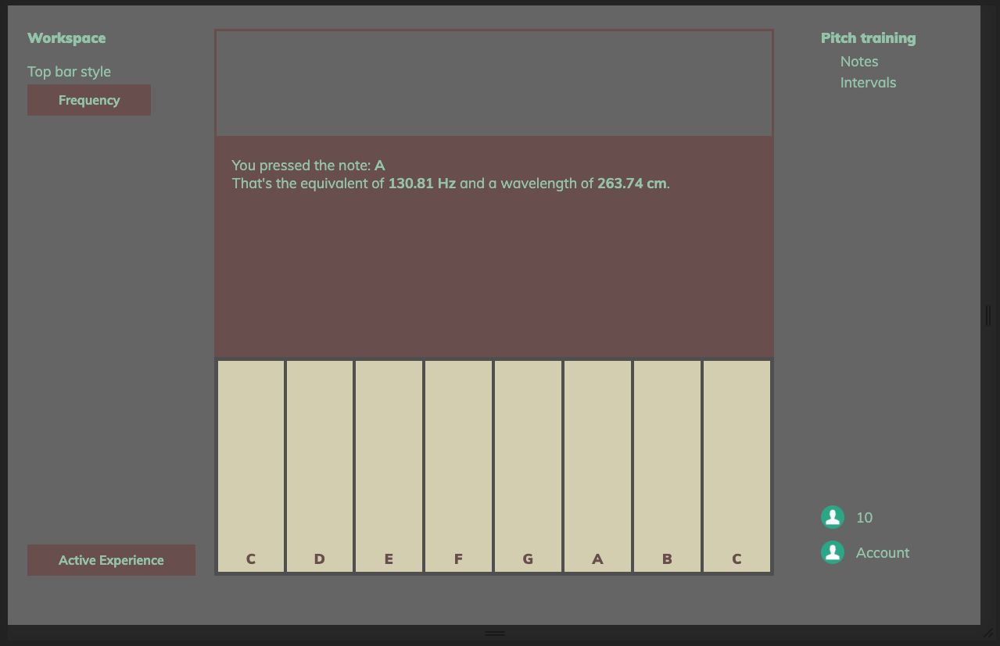

# appstract-piano



## Project setup
Run this first:
```
npm install
```

### Compiles and hot-reloads for development

Use this command to preview the code:

```
npm run serve
```

### Compiles and minifies for production
```
npm run build
```

### Run your tests
```
npm run test
```

### Lints and fixes files
```
npm run lint
```
